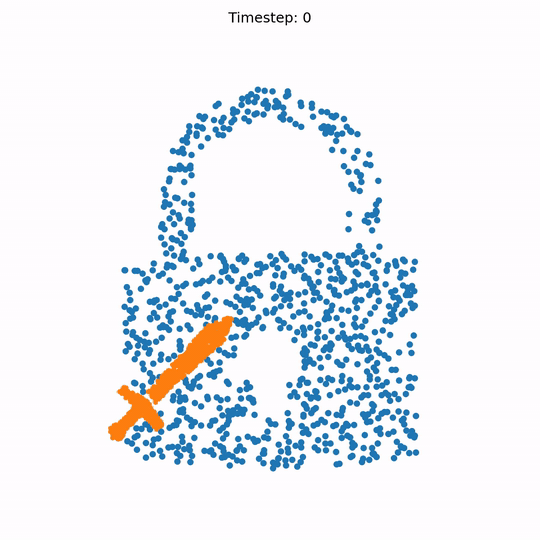
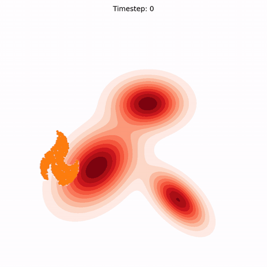
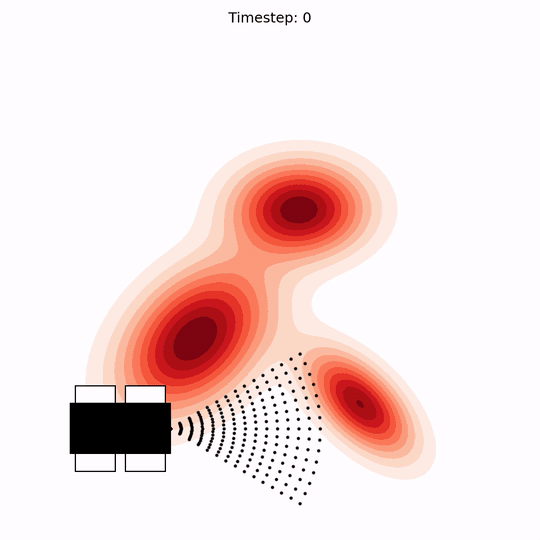

# Volumetric Ergodic Control (VEC)

This repository contains tutorial implementations for the paper [**"Volumetric Ergodic Control"**](https://arxiv.org/abs/2511.11533), presented at the [IEEE International Conference on Robotics and Automation (ICRA) 2026](https://2026.ieee-icra.org/).

Please visit the [**project website**](https://murpheylab.github.io/vec/) for more information.

## Tutorials

The `tutorials/` directory contains self-contained Jupyter notebooks with guided examples.
For faster performance in Colab, enable GPU: **Runtime → Change runtime type → T4 GPU**.

- [[Notebook](tutorials/erasing_mpc_samples.ipynb) | [Google Colab](https://colab.research.google.com/github/MurpheyLab/vec/blob/main/tutorials/erasing_mpc_samples.ipynb)] Erasing task with double-integrator dynamics, where the target is a point-cloud distribution and the volumetric state is a 2-D tool controlled from a pivot point.
- [[Notebook](tutorials/erasing_mpc_gaussian.ipynb) | [Google Colab](https://colab.research.google.com/github/MurpheyLab/vec/blob/main/tutorials/erasing_mpc_gaussian.ipynb)] Erasing task with double-integrator dynamics, where the target is a Gaussian mixture distribution and the volumetric state is a 2-D tool controlled from a pivot point.
- [[Notebook](tutorials/groundserach_mpc.ipynb) | [Google Colab](https://colab.research.google.com/github/MurpheyLab/vec/blob/main/tutorials/groundserach_mpc.ipynb)] Search task with a differential-drive robot, where the volumetric state is modeled as a forward-facing solid-state LiDAR.

  <table>
    <tr>
      <td align="center">
         
        <b>Point-Cloud Erasing</b>
      </td>
      <td align="center">
         
        <b>Gaussian Erasing</b>
      </td>
      <td align="center">
         
        <b>Ground Search</b>
      </td>
    </tr>
  </table>

All the tutorials are implemented using [JAX](https://github.com/jax-ml/jax) and [LQRax](https://github.com/MaxMSun/lqrax).

## Copyright and License

The implementations of VEC contained herein are copyright (C) 2025-2026 by Jueun Kwon, Max M. Sun, and Todd Murphey and are distributed under the terms of the GNU General Public License (GPL) version 3 or later. Please see the [LICENSE](LICENSE) for more information.

Contact: Jueun ([jueun@u.northwestern.edu](mailto:jueun@u.northwestern.edu))
